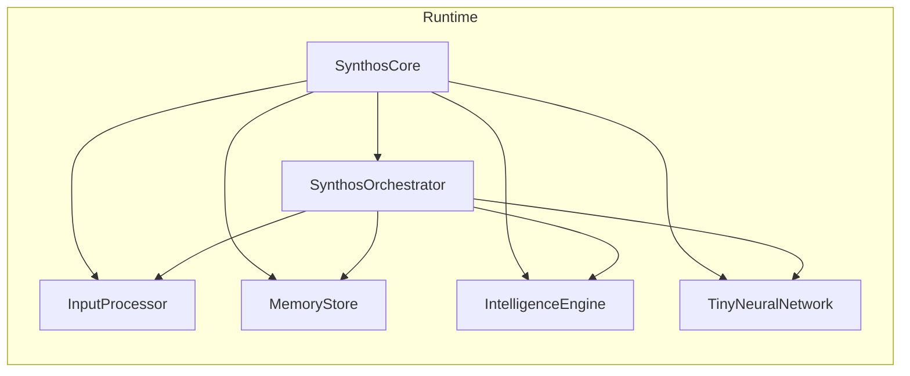

# Component interaction

```mermaid
flowchart LR
    subgraph Runtime
      C[SynthosCore]
      I[InputProcessor]
      M[MemoryStore]
      N[TinyNeuralNetwork]
      R[IntelligenceEngine]
      O[SynthosOrchestrator]
    end

    C --> I
    C --> M
    C --> R
    C --> N
    C --> O
    O --> I
    O --> M
    O --> R
    O --> N
```
