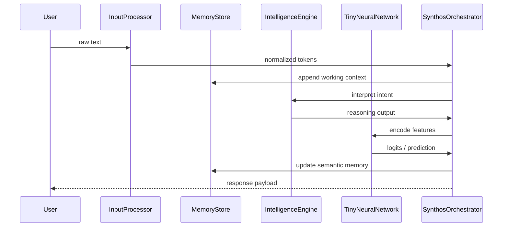

# Data flow

```mermaid
sequenceDiagram
    participant U as User
    participant I as InputProcessor
    participant M as MemoryStore
    participant R as IntelligenceEngine
    participant N as TinyNeuralNetwork
    participant O as SynthosOrchestrator

    U->>I: raw text
    I->>O: normalized tokens
    O->>M: append working context
    O->>R: interpret intent
    R->>O: reasoning output
    O->>N: encode features
    N->>O: logits / prediction
    O->>M: update semantic memory
    O-->>U: response payload
```
