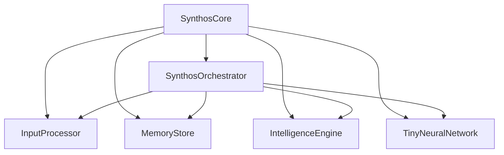

# Module architecture

```mermaid
flowchart TD
    A[SynthosCore] --> B[InputProcessor]
    A --> C[MemoryStore]
    A --> D[IntelligenceEngine]
    A --> E[TinyNeuralNetwork]
    A --> F[SynthosOrchestrator]
    F --> B
    F --> C
    F --> D
    F --> E
```

This module boundary keeps the runtime modular and reduces cross-coupling.
