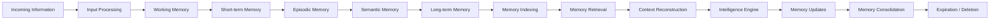

# Graphical memory representation

```mermaid
flowchart LR
    A[Incoming Information] --> B[Input Processing]
    B --> C[Working Memory]
    C --> D[Short-term Memory]
    D --> E[Episodic Memory]
    E --> F[Semantic Memory]
    F --> G[Long-term Memory]
    G --> H[Memory Indexing]
    H --> I[Memory Retrieval]
    I --> J[Context Reconstruction]
    J --> K[Intelligence Engine]
    K --> L[Memory Updates]
    L --> M[Memory Consolidation]
    M --> N[Expiration / Deletion]
```
